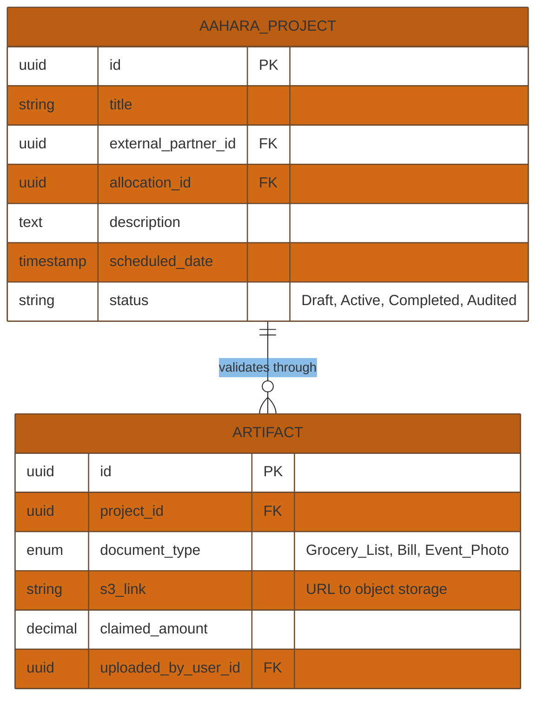
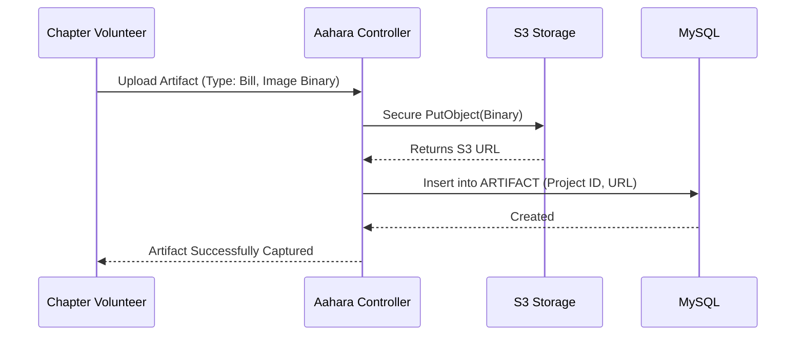

# Technical Requirement Document (TRD): BELAKU Aahara (Food Program System)

## 1. System Overview
The BELAKU Aahara subsystem controls the implementation of the food distribution arm of the NGO. It directly coordinates Target Entities (Beneficiary NGOs/Partners), Allocation rules, and distribution artifacts (Photos, grocery lists, bills) into auditable Project Events.

## 2. API Endpoints Architecture

| Endpoint                              | Method | Role Required          | Description                                                |
| ------------------------------------- | ------ | ---------------------- | ---------------------------------------------------------- |
| `/api/aahara/projects`                | `GET`  | All Admins             | List all ongoing and completed food distribution projects. |
| `/api/aahara/projects`                | `POST` | HO Admin, Chapter Pres | Create a new food project, tying an allocation ID.         |
| `/api/aahara/projects/{id}/artifacts` | `POST` | Chapter Team           | Upload proof (bills, grocery list, photos) to the project. |
| `/api/aahara/utilizations`            | `GET`  | HO Admin               | Fetch event-level specific utilization metrics.            |

## 3. Database Schema (Entity-Relationship)

## 4. Module Workflow Logic

### 4.1 Artifact Validation & Auditing

## 5. Security & Isolation Rules
- **Artifact Lockdown:** Once a project status marks as `Audited`, all related `ARTIFACT` records become locked on the backend. No user (not even HO Admin) can execute a standard update query.
