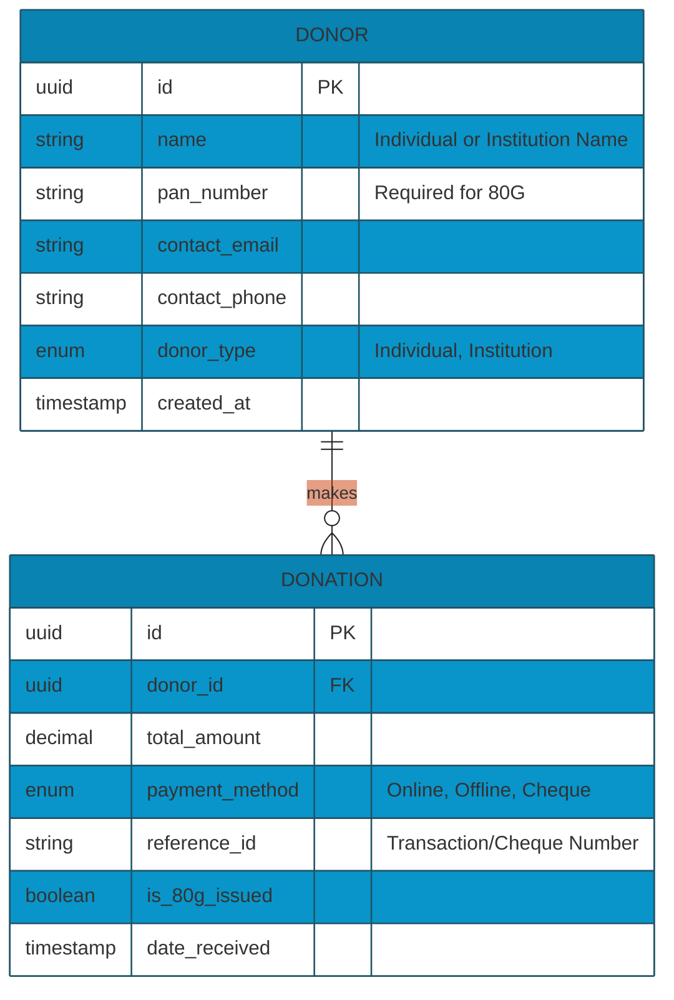
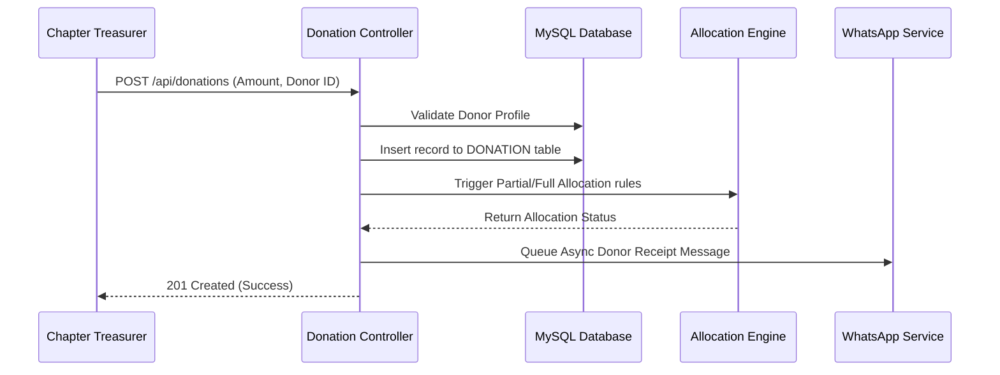

# Technical Requirement Document (TRD): Donor & Donation Management System

## 1. System Overview
The Donor & Donation Management System is the primary ingestion module for external funding. It provides an interface for both HO Finance and Chapter Treasurers to log donations (online/offline) and securely manages donor master profiles.

## 2. API Endpoints Architecture

| Endpoint           | Method | Role Required                 | Description                                                                      |
| ------------------ | ------ | ----------------------------- | -------------------------------------------------------------------------------- |
| `/api/donors`      | `GET`  | HO Finance, Chapter Treasurer | Fetch list of all donors (Chapter Treasurers see only localized list unless HO). |
| `/api/donors`      | `POST` | HO Admin                      | Create a new donor profile.                                                      |
| `/api/donors/{id}` | `GET`  | HO Finance, Donor             | Get specific donor details including history.                                    |
| `/api/donations`   | `POST` | HO Finance, Chapter Treasurer | Record a new donation (triggers allocation logic and WhatsApp alert).            |
| `/api/reports/80g` | `GET`  | Donor                         | Generate and download 80G tax receipt.                                           |

## 3. Database Schema (Entity-Relationship)

## 4. Module Workflow Logic

### 4.1 Donation Ingestion Workflow

## 5. Security & Isolation Rules
- **Chapter Isolation:** Treasurers associated with Chapter A cannot execute `GET /api/donors` without a tenant-scope middleware appending `WHERE chapter_id = X` to the Eloquent query.
- **Audit Trails:** Ensure every manipulation in `DONATION` executes an event listener logging into an `audit_logs` table tracking the specific `user_id` modifying records.
