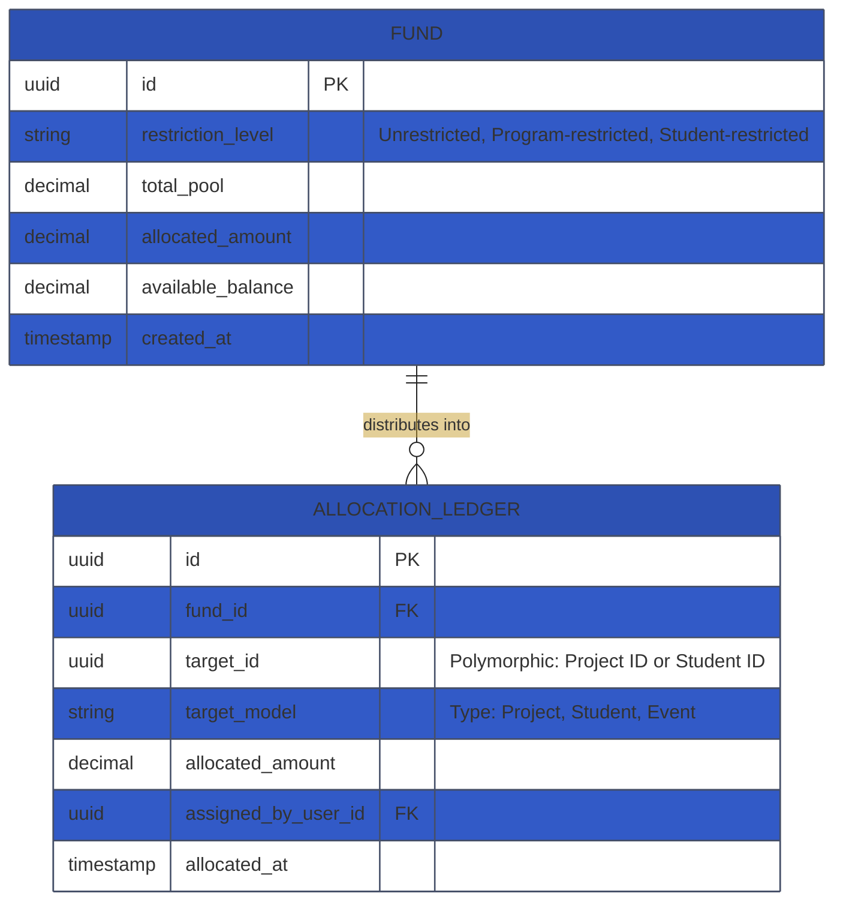
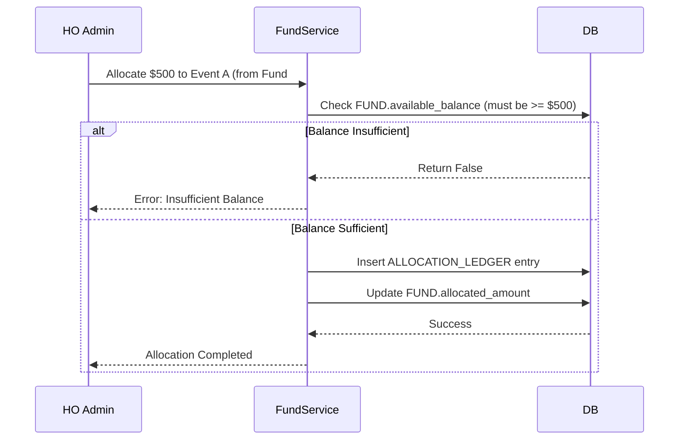

# Technical Requirement Document (TRD): Fund Allocation & Control Engine

## 1. System Overview
The Fund Allocation & Control Engine dictates how incoming funds are tracked, locked into designated accounts (Programs, Projects, or specific Students), and ultimately prevents double-spending or over-allocation.

## 2. API Endpoints Architecture

| Endpoint                     | Method | Role Required               | Description                                                        |
| ---------------------------- | ------ | --------------------------- | ------------------------------------------------------------------ |
| `/api/allocations`           | `GET`  | HO Admin, Chapter Treasurer | View current allocations, available balances.                      |
| `/api/allocations`           | `POST` | HO Admin                    | Perform partial/full fund allocations from a master donation fund. |
| `/api/allocations/{fund_id}` | `GET`  | HO Admin                    | See complete audit ledger for a specific fund chunk.               |

## 3. Database Schema (Entity-Relationship)

## 4. Module Workflow Logic

### 4.1 Strict Allocation Lock Logic
The logic preventing fund over-allocation will be handled at the database constraints and internal Service class level.

## 5. Security & Isolation Rules
- **Immutability:** Financial ledger entries inside `ALLOCATION_LEDGER` are read-only (`insert` and `select` only, never `update` or `delete`). Reversals require a compensatory reverse-entry.
