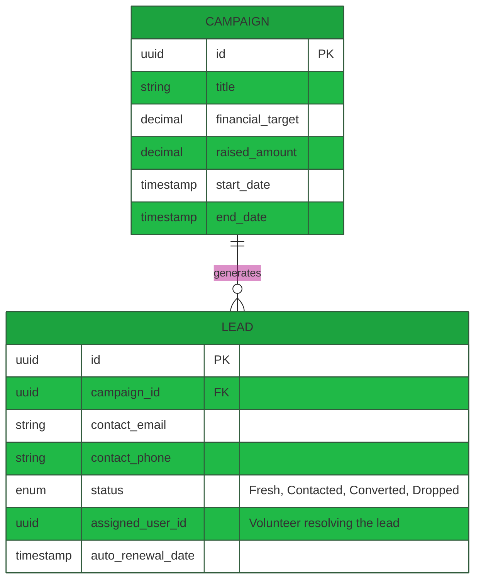

# Technical Requirement Document (TRD): Fundraising & Campaign Management

## 1. System Overview
The Fundraising & Campaign Management module is an analytical and operational framework used to structure global marketing efforts, capture leads, map conversion funnels, and track the overall ROI vs internal fundraising targets.
 
## 2. API Endpoints Architecture

| Endpoint                  | Method | Role Required     | Description                                                 |
| ------------------------- | ------ | ----------------- | ----------------------------------------------------------- |
| `/api/campaigns`          | `GET`  | HO Admin          | Fetch global active running fundraising campaigns.          |
| `/api/campaigns`          | `POST` | HO Admin          | Start a new fundraising project defining target fund value. |
| `/api/leads`              | `POST` | *Public Web API*  | External portal ingestion capturing donor intent (Leads).   |
| `/api/leads/{id}/convert` | `POST` | Chapter Treasurer | Converts a soft lead into an actual `DONOR` record.         |

## 3. Database Schema (Entity-Relationship)

## 4. Module Workflow Logic

### 4.1 Automated Renewal Process
1. A CRON job (`php artisan schedule:run`) triggers daily checking `LEAD.auto_renewal_date`.
2. Leads maturing today transition into an active "Renewal" pipeline view.
3. System triggers `/api/whatsapp/send` queuing an automated WhatsApp conversational nudge towards the lead.
