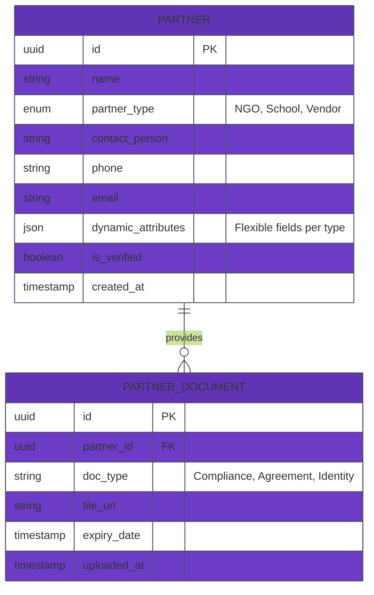
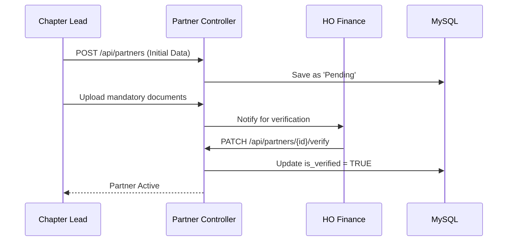

# Technical Requirement Document (TRD): Partner Management System

## 1. System Overview
The Partner Management system centralizes the profiles and compliance data for all external entities interacting with Chinivar Foundation, including NGO beneficiaries, partner schools, and vendors.
 
## 2. API Endpoints Architecture

| Endpoint                       | Method | Role Required     | Description                                                       |
| ------------------------------ | ------ | ----------------- | ----------------------------------------------------------------- |
| `/api/partners`                | `GET`  | All Admins        | List all partners with filtering by type.                         |
| `/api/partners`                | `POST` | HO Admin          | Onboard a new partner entity.                                     |
| `/api/partners/{id}/documents` | `POST` | Chapter Treasurer | Upload compliance docs (e.g., Trust Deed, PAN, Cancelled Cheque). |
| `/api/partners/{id}/history`   | `GET`  | HO Admin          | View transaction and engagement history with the partner.         |

## 3. Database Schema (Entity-Relationship)

## 4. Module Workflow Logic

### 4.1 Partner Verification Flow

## 5. Security & Isolation Rules
- **Dynamic Attributes:** Use JSON columns in MySQL to allow for different field sets (e.g., Aadhar for individuals, GST for vendors) without schema migrations for setiap partner type.
- **Sensitive Docs:** Partner documents stored in S3 must use pre-signed URLs with a 5-minute expiry to prevent unauthorized link sharing.
