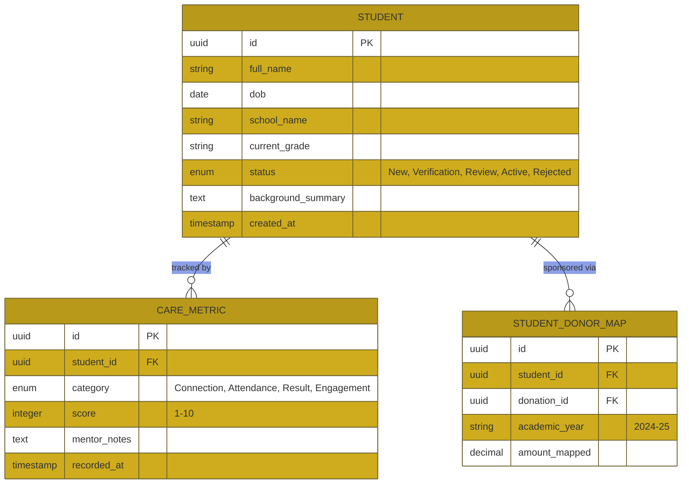

# Technical Requirement Document (TRD): BELAKU Shikshana (Student Sponsorship)

## 1. System Overview
The BELAKU Shikshana module manages the end-to-end student sponsorship lifecycle. It tracks student progress using the "CARE" model and maps specific donors to student needs per academic year.
 
## 2. API Endpoints Architecture

| Endpoint                      | Method  | Role Required | Description                                         |
| ----------------------------- | ------- | ------------- | --------------------------------------------------- |
| `/api/students`               | `GET`   | Mentor, Admin | List students (Mentors see only assigned students). |
| `/api/students`               | `POST`  | School Admin  | Submit new student application.                     |
| `/api/students/{id}/verify`   | `PATCH` | Chapter Team  | Background verification status update.              |
| `/api/students/{id}/timeline` | `GET`   | Donor         | Get student progress timeline, updates, and photos. |
| `/api/mappings/student-donor` | `POST`  | HO Finance    | Map a donor fund to a specific student for a year.  |

## 3. Database Schema (Entity-Relationship)

## 4. Module Workflow Logic

### 4.1 Student Selection Pipeline
1. **Application:** School Admin submits initial data.
2. **Verification:** Chapter Team conducts house visit and uploads verification report.
3. **Internal Review:** HO Admin reviews case and moves status to `Active`.
4. **Matching:** HO Finance maps unallocated donor funds to the student for the current academic year.

## 5. Security & Isolation Rules
- **Data Privacy:** Student photos and personal family details are strictly masked from the public. Only mapped donors and assigned mentors can view specific student dashboard views.
- **Academic Roll-over:** A yearly automated task clones student records into the new academic year session to allow for re-verification and new donor mapping.
