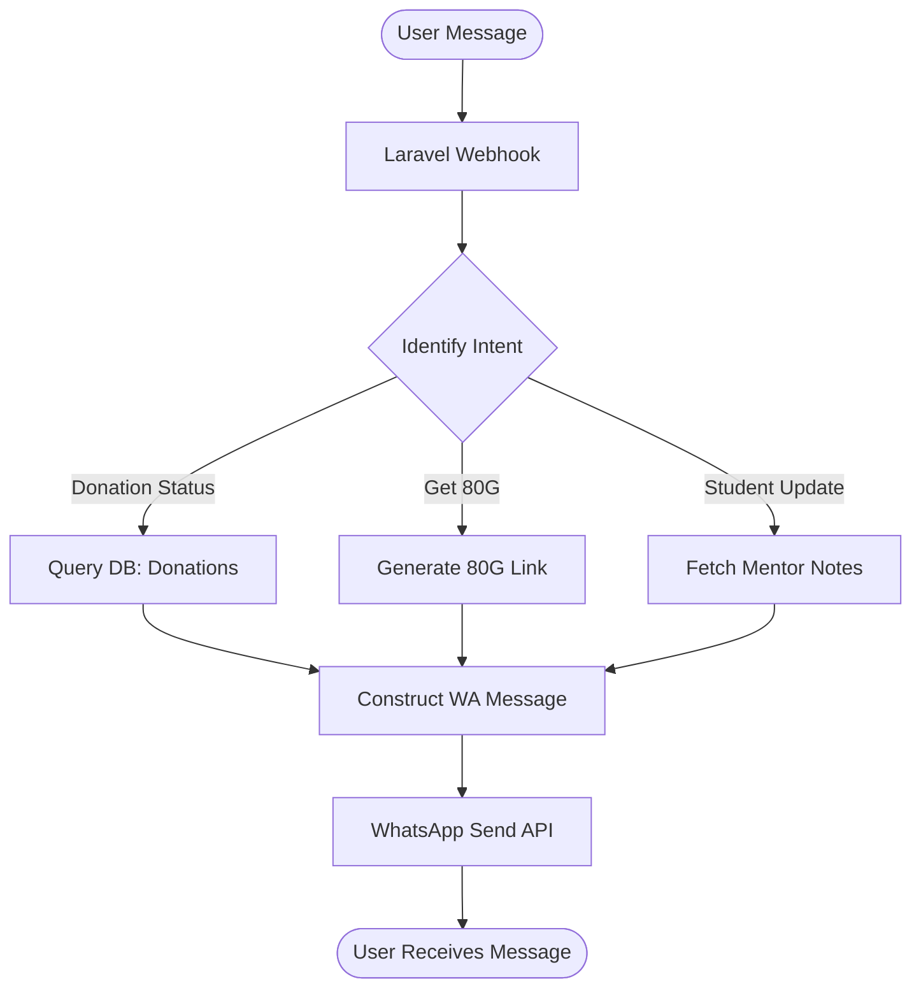

# Technical Requirement Document (TRD): WhatsApp Communication System

## 1. System Overview
WhatsApp serves as the primary bridge between the foundation and its external stakeholders (Donors, Mentors, Partners). This system handles automated notifications, receipt delivery, and AI-driven status queries via a chatbot interface.
 
## 2. API Endpoints Architecture

| Endpoint                | Method | Role Required | Description                                       |
| ----------------------- | ------ | ------------- | ------------------------------------------------- |
| `/api/whatsapp/webhook` | `POST` | *Public*      | Inbound messages from Meta/WhatsApp API.          |
| `/api/whatsapp/send`    | `POST` | System/Admin  | Send template-based or session message to a user. |
| `/api/whatsapp/logs`    | `GET`  | HO Admin      | Audit trail of all sent/received messages.        |

## 3. Infrastructure & Integration

### 3.1 Metadata Integration
- **Platform:** Meta for Developers (WhatsApp Business API).
- **Service Provider:** Direct Cloud API or Twilio/Gupshup (depending on volume).
- **Template Management:** Pre-approved Meta templates for 80G receipts, donation alerts, and event invites.

### 3.2 Chatbot Logic Flow

## 4. Functional Requirements

### 4.1 Automated Event Triggers
- **Donation Received:** Fire notification: "Thank you for ₹X. Your allocation for [Project Y] is confirmed."
- **Verification Complete:** Notify Mentor: "Student [Name] is successfully verified. View the profile on your portal."
- **Event Invitation:** Broadcast to Chapter Donors: "BELAKU Aahara event scheduled for [Date] at [Location]."

## 5. Security & Isolation Rules
- **Opt-In Management:** System must maintaining an `opt_in` flag per user. No marketing messages to be sent unless explicit opt-in is recorded.
- **Message Encryption:** All communication is end-to-end encrypted by WhatsApp; Laravel stores only metadata and log summaries for audit purposes.
